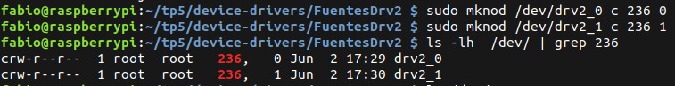
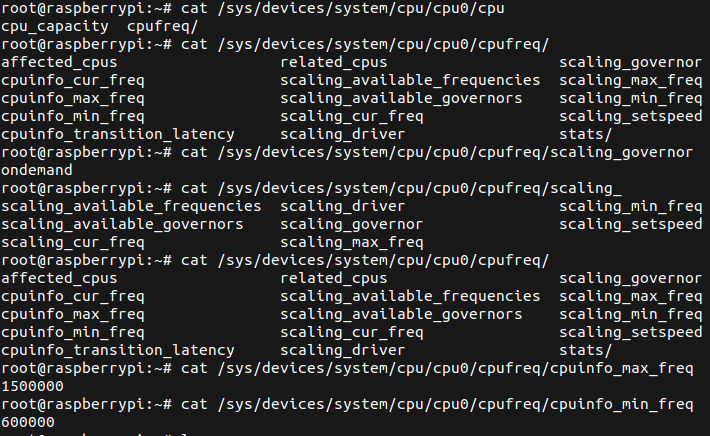

***TRABAJO PRACTICO 5***

**Titulo:** Device Drivers 🎯

**Asignatura:** Sistemas de Computación 💻

**Integrantes:**
   - Cabrera, Augusto Gabriel 
   - Moroz, Esteban Mauricio 
   - Britez, Fabio
   - Gonzalez, Bruno

-------------
</p>

# Marco Teórico

### ¿ Qué es un driver ?

Se trata de un software que permite al sistema operativo interactuar con un periférico, creando una abstracción del hardware y proporcionando una interfaz para utilizarlo. 

### "Device Controller", "Bus Driver" y "Device Driver"

Un device controller es un componente de hardware que se encarga de gestionar y controlar la operación de un dispositivo específico.

Un bus driver es un software que controla la comunicación a través de un bus de hardware, facilitando la comunicación con dispostivos conectados.

Finalmente, el device driver permite la gestión de este sistema a través del sistema operativo, facilitando el control de un dispositivo especiífico

<p align="center">
  
</p>


### Clasificación de un driver en linux

En Linux un “driver” se clasifica en general en tres verticales:
 - Orientado a paquetes o vertical “Network”
 - Orientado a bloques o vertical “Storage”
 - Orientado a bytes o vertical “Character”

### Character Device Driver "CDD" y Character Device File "CDF"

Un CDD es un tipo de controlador de dispositivo en sistemas operativos que gestiona dispositivos que transfieren datos como un flujo continuo de caracteres. En sistemas operativos como Linux, los Character Device Drivers son implementados como módulos del kernel y se registran con el sistema operativo para proporcionar acceso a los dispositivos. 

Un Character Device File (CDF) es una interfaz crucial en sistemas Unix/Linux que permite a las aplicaciones interactuar con dispositivos de carácter a través de operaciones de archivo estándar, facilitando el acceso a hardware específico mediante el sistema de archivos.
Por lo tanto, el CDF está asociado con un Character Device Driver que maneja las operaciones de I/O. Cuando una aplicación realiza una operación en el CDF, el sistema operativo redirige esa operación al driver correspondiente.


---------------------


# Desarrollo 

## Implementación de un CDD

Procedemos a compilar el código fuente del módulo de kernel/CDD drv1.c y cargamos dicho módulo a través de su constructor con "insmod".
Para descargar el módulo del núcleo del kernel llamamos a su destructor a través de rmmod.

Podemos evidenciar la carga y descarga del CDD gracias a sus funciones module_init() y module_exit():


## Conexión entre CDF y CDD

Para conectar CDF con sus correspondientes CDD se utilizan los índices "major" y "minor". El número "major" identifica el controlador de dispositivo (Character Device Driver o CDD) responsable de manejar las solicitudes de I/O para ese tipo de dispositivo. El número "minor" identifica un dispositivo específico gestionado por ese controlador.

Cargamos el módulo "drv2" cuyo major designado es 236 e instanciamos dos dispositivos menor 1 y 2.




## Revisión de dispositivos en /sys
El directorio /sys proporciona una vista jerárquica de varios aspectos del sistema, incluidos los dispositivos detectados.

En este caso, observamos información relacionada con la CPU.



## Operaciones del CDF

Funciones del drv3:

```c
static int my_open(struct inode *i, struct file *f)
{
printk(KERN_INFO "Driver3_SdeC: open()\n");
return 0;
}

static int my_close(struct inode *i, struct file *f)
{
printk(KERN_INFO "Driver3_SdeC: close()\n");
return 0;
}

static ssize_t my_read(struct file *f, char __user *buf, size_t len, loff_t *off)
{
printk(KERN_INFO "Driver3_SdeC: read()\n");
return 0;
}

static ssize_t my_write(struct file *f, const char __user *buf, size_t len, loff_t *off)
{
printk(KERN_INFO "Driver3_SdeC: write()\n");
return len;
}
```

Interactuando con el CDF del drv3:


No obtenemos ninguna salida, el valor de retorno de las funciones my_open() y my_close() son triviales. Pero no así read() y write() que devuelven ssize_t. 

La mejora de drv3 la encontramos en drv4, 


