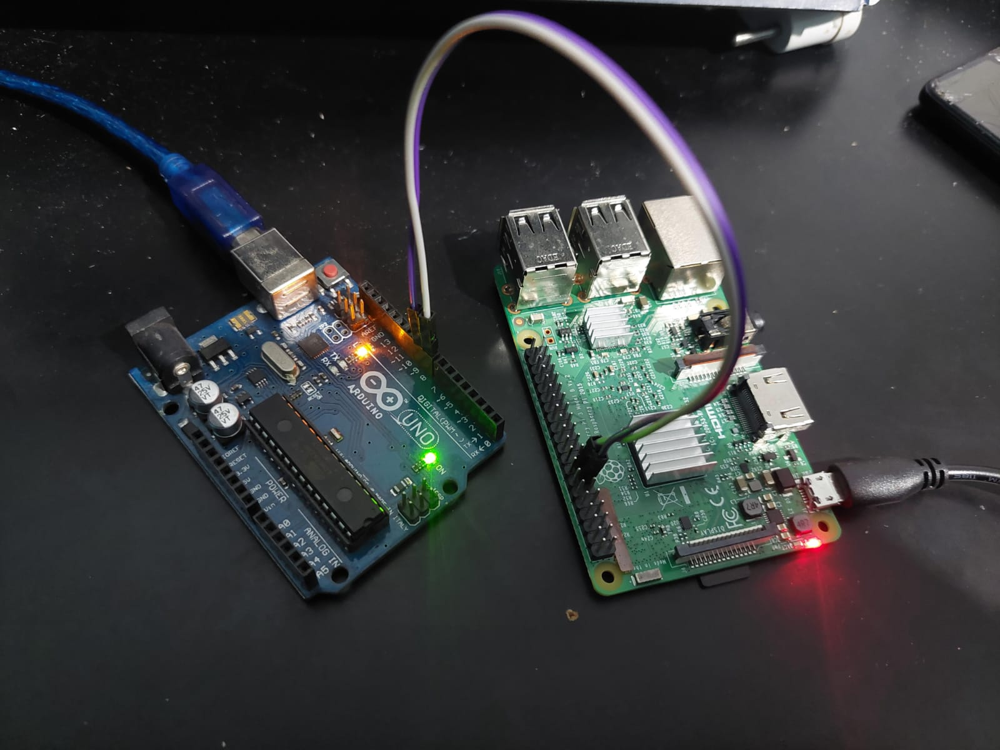
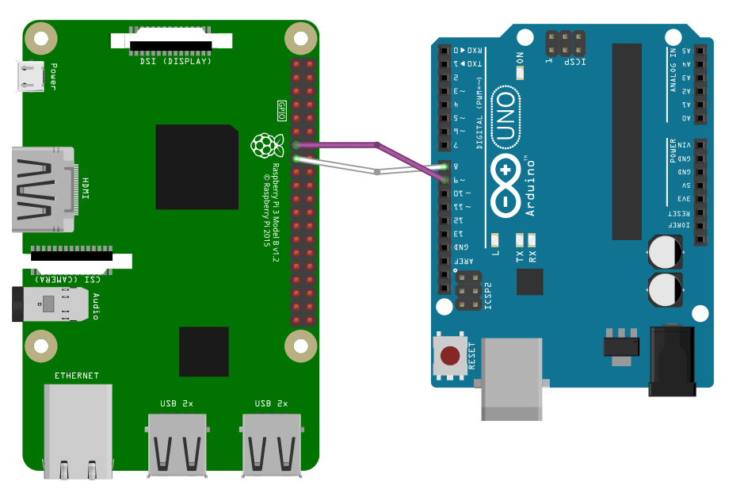

***TRABAJO PRACTICO 5***

**Titulo:** Device Drivers 🎯

**Asignatura:** Sistemas de Computación 💻

**Integrantes:**
   - Cabrera, Augusto Gabriel 
   - Moroz, Esteban Mauricio 
   - Britez, Fabio
   - Gonzalez, Bruno

-------------
</p>

# Marco Teórico

### ¿ Qué es un driver ?

Se trata de un software que permite al sistema operativo interactuar con un periférico, creando una abstracción del hardware y proporcionando una interfaz para utilizarlo. 

### ¿ Quién los construye ?

Habitualmente son los fabricantes del hardware quienes escriben sus drivers, ya que conocen mejor el funcionamiento interno de cada hardware, pero también se encuentran controladores libres, por ejemplo en los sistemas operativos libres (Linux, FreeBSD, OpenBSD, ReactOS, Haiku, etc). 

En este caso, los creadores no son de la empresa fabricante, aunque a veces hay una cooperación con ellos, cosa que facilita el desarrollo. Si no la hay, el procedimiento necesita de ingeniería inversa y otros métodos con riesgos legales.


### "Device Controller", "Bus Driver" y "Device Driver"

Un device controller es un componente de hardware que se encarga de gestionar y controlar la operación de un dispositivo específico.

Un bus driver es un software que controla la comunicación a través de un bus de hardware, facilitando la comunicación con dispostivos conectados.

Finalmente, el device driver permite la gestión de este sistema a través del sistema operativo, facilitando el control de un dispositivo especiífico

<p align="center">
  
</p>


### Clasificación de un driver en linux

En Linux un “driver” se clasifica en general en tres verticales:
 - Orientado a paquetes o vertical “Network”
 - Orientado a bloques o vertical “Storage”
 - Orientado a bytes o vertical “Character”

### Character Device Driver "CDD" y Character Device File "CDF"

Un CDD es un tipo de controlador de dispositivo en sistemas operativos que gestiona dispositivos que transfieren datos como un flujo continuo de caracteres. En sistemas operativos como Linux, los Character Device Drivers son implementados como módulos del kernel y se registran con el sistema operativo para proporcionar acceso a los dispositivos. 

Un Character Device File (CDF) es una interfaz crucial en sistemas Unix/Linux que permite a las aplicaciones interactuar con dispositivos de carácter a través de operaciones de archivo estándar, facilitando el acceso a hardware específico mediante el sistema de archivos.
Por lo tanto, el CDF está asociado con un Character Device Driver que maneja las operaciones de I/O. Cuando una aplicación realiza una operación en el CDF, el sistema operativo redirige esa operación al driver correspondiente.


---------------------


# Desarrollo 

## Implementación de un CDD

Procedemos a compilar el código fuente del módulo de kernel/CDD drv1.c y cargamos dicho módulo a través de su constructor con "insmod".
Para descargar el módulo del núcleo del kernel llamamos a su destructor a través de rmmod.

Podemos evidenciar la carga y descarga del CDD gracias a sus funciones module_init() y module_exit():


## Conexión entre CDF y CDD

Para conectar CDF con sus correspondientes CDD se utilizan los índices "major" y "minor". El número "major" identifica el controlador de dispositivo (Character Device Driver o CDD) responsable de manejar las solicitudes de I/O para ese tipo de dispositivo. El número "minor" identifica un dispositivo específico gestionado por ese controlador.

Cargamos el módulo "drv2" cuyo major designado es 236 e instanciamos dos dispositivos menor 1 y 2.


## Revisión de dispositivos en /sys
El directorio /sys proporciona una vista jerárquica de varios aspectos del sistema, incluidos los dispositivos detectados.

En este caso, observamos información relacionada con la CPU.


## Operaciones del CDF

Funciones del drv3:

```c
static int my_open(struct inode *i, struct file *f)
{
printk(KERN_INFO "Driver3_SdeC: open()\n");
return 0;
}

static int my_close(struct inode *i, struct file *f)
{
printk(KERN_INFO "Driver3_SdeC: close()\n");
return 0;
}

static ssize_t my_read(struct file *f, char __user *buf, size_t len, loff_t *off)
{
printk(KERN_INFO "Driver3_SdeC: read()\n");
return 0;
}

static ssize_t my_write(struct file *f, const char __user *buf, size_t len, loff_t *off)
{
printk(KERN_INFO "Driver3_SdeC: write()\n");
return len;
}
```

Interactuando con el CDF del drv3:


No obtenemos ninguna salida, el valor de retorno de las funciones my_open() y my_close() son triviales. Pero no así read() y write() que devuelven ssize_t. 

La mejora de drv3 la encontramos en drv4, 

<!-- CREO QUE FALTA DRV4 -->


# Desafio 


 Diseñar y construir un CDD que permita sensar dos señales externas con un periodo de UN segundo. Luego una aplicación a nivel de usuario deberá leer UNA de las dos señales y graficarla en función del tiempo. La aplicación tambien debe poder indicarle al CDD cuál de las dos señales leer. Las correcciones de escalas de las mediciones, de ser necesario, se harán a nivel de usuario. Los gráficos de la señal deben indicar el tipo de señal que se
está sensando, unidades en abcisas y tiempo en ordenadas. Cuando se cambie de señal el gráfico se debe "resetear" y acomodar a la nueva medición.


#  Solución


### Equipo Utilizado

- Raspberry Pi 3B (2015)
- Arduino UNO

La conexión se detalla a continuación:






## Procedimiento


Utilizando el Arduino UNO, se generan dos tipos de señales distintas, desfasadas entre sí, a través de los pines 8 y 9. Estas señales ingresan a la Raspberry Pi, la cual tiene el CDD embebido (descrito a continuación). El driver en cuestión es el archivo `CDD/signal_input.c`.

### `CDD/signal_input.c`

### Funciones Principales

**NOTA: Al declarar los pines como entrada, la librería no funcionaba correctamente, por lo que se recurrió a realizar un mapeo manual.**

- `static int __init gpio_signal_init(void);`  
  Esta función se llama cuando se carga el módulo. Inicializa los registros GPIO y registra el dispositivo de caracteres. Primero, mapea la memoria GPIO, configura los pines GPIO como entrada y luego registra el dispositivo de caracteres.

- `static void __exit gpio_signal_exit(void);`  
  Esta función se llama cuando se descarga el módulo. Desregistra el dispositivo de caracteres y desmapea la memoria GPIO.

### Funciones de Lectura y Escritura del Dispositivo

- `static ssize_t device_read(struct file *file, char *buffer, size_t len, loff_t *offset);`  
  Se llama cuando se lee el archivo del dispositivo para obtener el valor del pin GPIO seleccionado. Lee el valor del pin y lo convierte en una cadena para ser copiada al búfer del usuario.

- `static ssize_t device_write(struct file *file, const char *buffer, size_t len, loff_t *offset);`  
  Se llama cuando se escribe en el archivo del dispositivo para seleccionar el pin para leer la señal. Lee el número del pin del búfer del usuario y configura el pin seleccionado en el controlador.

### Configuración de Pines GPIO

- `static void configure_gpio_as_input(unsigned int pin);`  
  Configura el pin GPIO especificado como entrada. Calcula el índice y la posición del bit en el registro FSEL correspondiente al pin y lo configura como entrada.

Estas funciones son fundamentales para el funcionamiento del controlador de señal de entrada GPIO en la Raspberry Pi.


### Variables Globales

- `static int major_number = 0;`  
  Almacena el número de dispositivo principal asignado dinámicamente. Es necesario para registrar el dispositivo de caracteres.

- `static unsigned int selected_pin = 0;`  
  Almacena el número del pin GPIO seleccionado para leer la señal. Se establece por defecto en `gpio_pin1`.

- `static unsigned int *gpio_registers = NULL;`  
  Un puntero utilizado para mapear la dirección base de los registros GPIO en la memoria física. Permite acceder y manipular los registros GPIO.

Estas variables son esenciales para la configuración y operación del controlador de señal de entrada GPIO en la Raspberry Pi.

### Funcionamiento General del Código

1. **Inicialización del Módulo:**
   - En la función `gpio_signal_init`, se mapea la memoria GPIO, se configuran los pines GPIO como entrada y se registra el dispositivo de caracteres.
  
2. **Operaciones de Lectura y Escritura:**
   - La función `device_read` lee el valor del pin GPIO seleccionado y lo convierte en una cadena para ser copiada al búfer del usuario cuando se lee el archivo del dispositivo.
   - La función `device_write` selecciona el pin GPIO para leer la señal cuando se escribe en el archivo del dispositivo.

3. **Configuración de Pines GPIO:**
   - La función `configure_gpio_as_input` configura el pin GPIO especificado como entrada, limpiando los bits correspondientes en el registro FSEL y configurándolos como entrada.

4. **Liberación del Módulo:**
   - En la función `gpio_signal_exit`, se desregistra el dispositivo de caracteres y se desmapea la memoria GPIO cuando se descarga el módulo.

**RESUMEN**: *El código proporciona un controlador de señal de entrada GPIO que permite detectar el estado de dos señales externas conectadas a pines GPIO en una Raspberry Pi y seleccionar cuál de las dos señales leer*.


